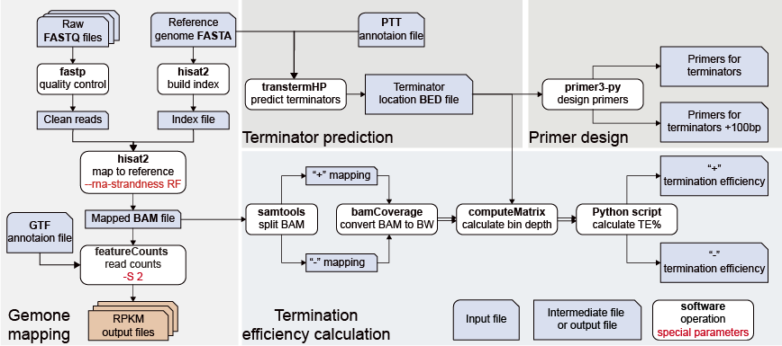

# Terminator prediction and termination efficiency calculation pipeline

## Requeirements
* transtermhp
* fastp
* hisat2
* samtools
* featurecounts
* deeptools
* pigz
* primer3-py
* biopython
* alive-progress

please install listed packages before running scripts.

## Step-1
Predict terminators using TranstermHP

### Create ptt file

Clone the repository and generate ptt file by following the instruction of gbkToPttAndRnt:
```bash
git clone https://github.com/HenryWiersma/gbkToPttAndRnt.git
cd gbkToPttAndRnt/
python3 gbkToPttAndRnt.py pathToGenBankFile.gb
```
### Predict terminators
Before running, please install TransTermHP, the .dat file is in the install folder. 

```bash
transterm -p expterm.dat seq.fasta annotation.ptt > output.tt
```
BE CAUTION, sequence name and file name MUST be SAME.

The 'output.tt' shows below:
```text
TransTermHP v2.08 (built on Feb 18 2023)
25 bins; sample size is 20000000
--pval-conf=./expterm.dat

--gc=-2.3 --au=-0.9 --gu=1.3 --mm=3.5 --gap=6
--max-len=59 --min-stem=4 --max-loop=13 --min-loop=3
--uwin-length=6 --uwin-require=3 --max-hp-score=-2 --max-tail-score=-2.5
--loop-penalty=1,2,3,4,5,6,7,8,9,10,11
--start-cut=0 --end-cut=25

Genes: 0.521309 %AT, 1736439 nt, 18010 terms.
Intergenic: 0.619536 %AT, H2T: 205711 nt, 2184 terms; T2T: 62595 nt, 1419 terms; H2H: 91590 nt, 1669 terms. 

Each terminator entry starts in column 3 and is of the form:
  term #       start - end      +/-  regionconf   hp     tail | notes
Followed by the sequence of the 5' tail, 5' stem, loop, 3' stem, and 3' tail.
Genes are interspersed, and start the first column.


SEQUENCE CP023715.rr  (length 2058755)

ZMO1_ZMO0001      147 - 2516     + | TonB-dependent receptor
ZMO1_ZMO0002     2538 - 3653     + | histidinol-phosphate aminotransferase HisC
  TERM 1         3688 - 3664     - T   100 -12.9 -5.27779 | opp_overlap 3660 3659 3658, overlap 3656
  CTTAATAGGAAAAAA          GCCTTCCCG TTTAAGG CGGGAAGGC          TTAGGATTTTATAAG
ZMO1_ZMO0003     4329 - 3697     - | adenylyl-sulfate kinase
ZMO1_ZMO0004     5770 - 4340     - | sulfate adenylyltransferase large subunit
ZMO1_ZMO0005     6689 - 5781     - | sulfate adenylyltransferase small subunit
ZMO1_ZMO0006     8115 - 6700     - | siroheme synthase CysG
ZMO1_ZMO0007     9120 - 8386     - | phosphoadenosine phosphosulfate reductase
ZMO1_ZMO0008    10843 - 9131     - | sulfite reductase (NADPH) hemoprotein beta-component
ZMO1_ZMO0009    12663 - 10843    - | sulfite reductase (NADPH) flavoprotein alpha chain
ZMO1_ZMO0010    13006 - 13716    + | DUF45 domain-containing protein
....
```


## Step-2
### Extract terminator information

```bash
Terminator_extract.py -i /path/to/output.tt -o ./Terminator_info.csv -l ZMO1_ZMO -c CP023715 -s CP023715.fasta -t Term-seq.txt
```
You should input the basename of locus tag to help the program to identify the upstram and downstream gene of terminators through ```-l``` option.
 
The ```-c```option is used to specify the terminator BED file output prefix, which is used to indicate the chromosome where the terminator is located.

The ```-s```option is used to specify the genome sequence which is used to amplify terminator through PCR. The primer3-py using this sequence as template sequence to design best primer for PCR.

The ```-s```option is used to specify the location of transcriptional termination sites (TTSs). TTS name, strand and location is septated by TAB:
```text
TERM_0001	-	3657
TERM_0003	-	8304
TERM_0004	-	8308
TERM_0005	-	8309
TERM_0006	-	8909
TERM_0007	-	8913
TERM_0008	-	9208
TERM_0009	-	9576
TERM_0010	-	11116
TERM_0011	-	12569
TERM_0012	-	12572
TERM_0013	-	12619
TERM_0015	+	17482
TERM_0016	+	17889
TERM_0017	+	17895
TERM_0018	+	18156
TERM_0019	+	18417
TERM_0020	+	18574
TERM_0021	+	18995
TERM_0022	+	19059
TERM_0023	+	19060
TERM_0024	+	19081
TERM_0025	+	19082
TERM_0026	+	19083
TERM_0027	+	20519
TERM_0028	+	20520
TERM_0032	-	39379
TERM_0033	-	39462
TERM_0034	-	39464
....
```

## Step-3
### Termination efficiency calculation

```bash
TE_calculation.py -d /path/to/fastq/files -t 16 -p Zymo_omics -r /path/to/CP023715.fasta --gtf /path/to/CP023175.gtf --type gene --bed /path/to/CP023715_Ter.bed 
```
The of strand-specific paired-end RNA-seq FASTQ files were input with the reference genoem and terminator BED file, we can get the depth around terminators. Through the depth change we can know the change of trancription flux around terminator and then we kone the termination efficiency.

The```--gtf```option give the annotation file to featureCounts to calculate the reads count of genes.

The```-p``` option names this project and the index file name of reference index file built by hisat2.

THe```--type``` option is used to specify the level to count reads. You can only select `gene`,`exon` or `CDS`.

This two files contains what we need:
* TE_of_terminaotrs_in_plus_strand_FR.csv
* TE_of_terminaotrs_in_minus_strand_FR.csv


